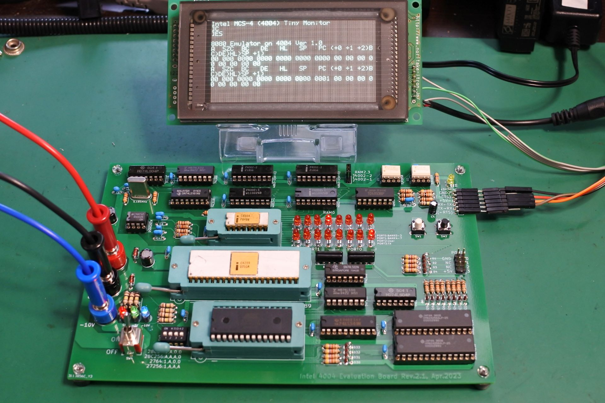
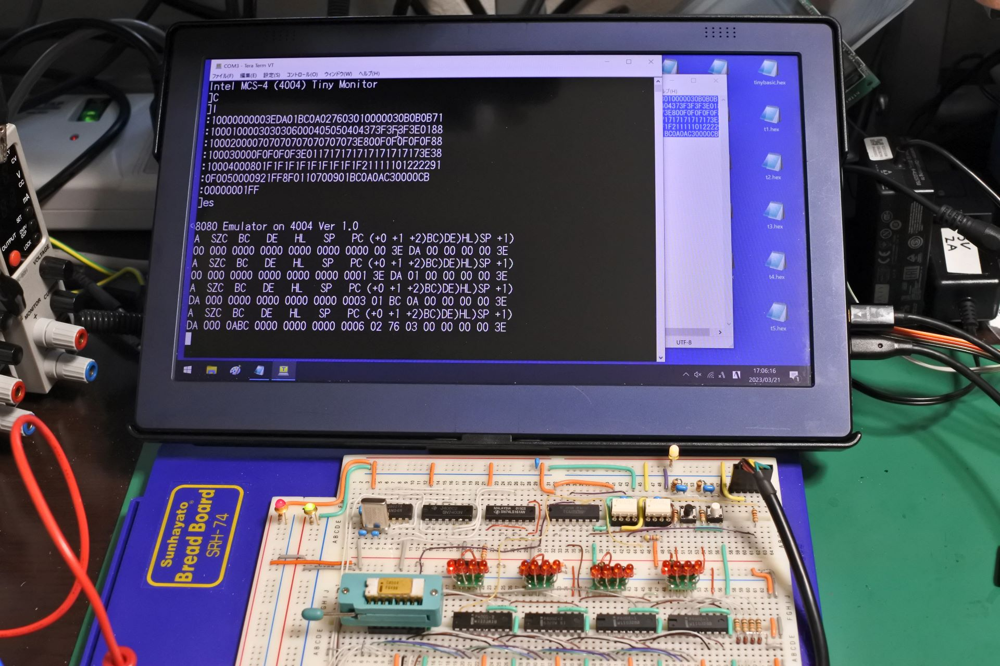
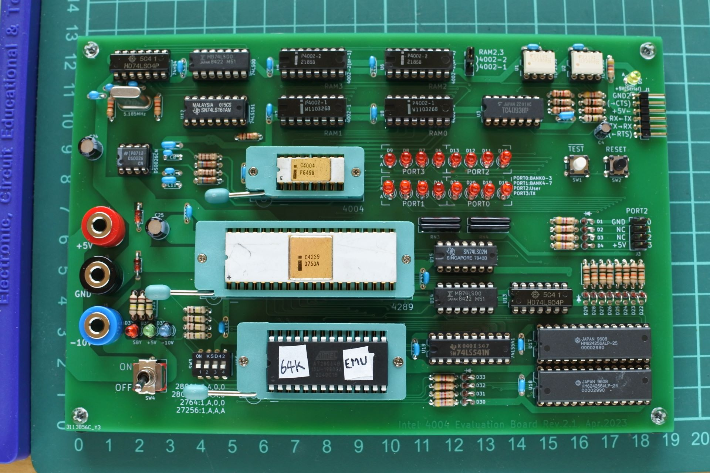
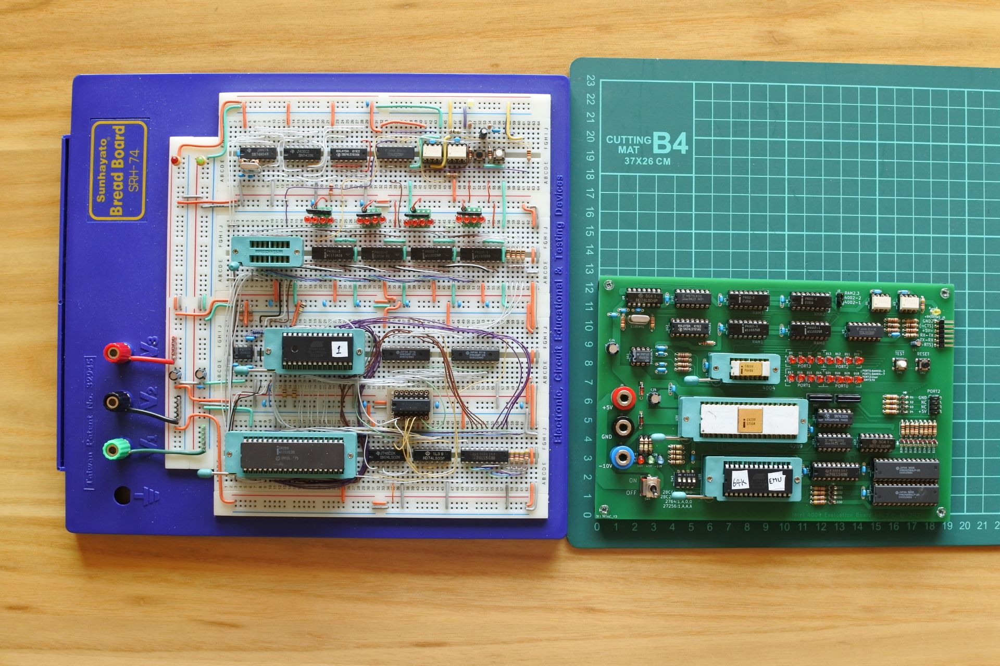

# emu8080on4004
Intel 8080 Emulator on 4004 Evaluation Board

This document is written mostly in Japanese.
If necessary, please use a translation service such as DeepL (I recommend this) or Google.

## 概要
自作の4004実験用ボードと，その上で動作する8080エミュレータです．Palo Alot Tiny BASICがほぼそのまま動くレベルの機能が実現できています．

## 制限事項等
- P(パリティ)フラグはデフォルトでは実装されません．アセンブルオプションで変更できますが，動作は未確認です．
- DAA命令の実装は正確ではありません．
- 割り込み関連命令(DI, EI)も未実装です．
- IN命令は4004ボードのソフトウェアで実装されたUARTのGETCHARを呼ぶので，入力されるまで止まります．
- OUT命令はAレジスタを4004ボードのシリアルポートに出力します．

## 実験ボードの仕様
### ブレッドボード版プロトタイプ
- CPU: Intel 4004
- Clock: 740kHz
- DATA RAM: 4002-1 x 2 + 4002-2 x 2 (計320bit x 4)
- Program Memory
  - ROM: AT28C64B (8k x 8bit EEPROM)
    - 000H〜EFFHの3.75KB利用可能
  - RAM: HM6268(4k x 4bit SRAM)x 2個
    - 物理メモリ F00H〜FFDHの254byte x 16バンク
      (上記を論理メモリ 000H〜FDFHにマッピングしてアクセス)
- 通信ポート: 9600bps Software Serial UART (TTL level)

### Rev.2.1版(ブレッドボード版との差分)
- Program Memory
  - RAM: HM6242566(1Mbit(256k x 4bit) SRAM)x 2個
    - 物理メモリ F00H〜FFDHの254byte x 256バンク
      (上記を論理メモリ 0000H〜FDFFHにマッピングしてアクセス)

## ToDO
- メモリ64KBに拡張
- プリント基板作成(基板発注済(2023/4/8)．ガーバーファイル等は近日公開予定)

## 動画
Youtubeで関連動画を公開しています．
- https://www.youtube.com/@ryomukai/videos

## ブログ
関連する情報が書いてあるかも．
- [Intel 4004 関連記事の目次@ブログの練習](https://blog.goo.ne.jp/tk-80/e/3fa1e2972737c7b7d1b83f4e7bd648a2)

### 4004関連開発事例
- [Intel 4004  50th Anniversary Project](https://www.4004.com/)
  - https://www.4004.com/busicom-replica.html
  - http://www.4004.com/2009/Busicom-141PF-Calculator_asm_rel-1-0-1.txt
- https://github.com/jim11662418/4004-SBC
- https://www.cpushack.com/mcs-4-test-boards-for-sale
- https://github.com/novi/4004MainBoard

### データシート
- http://www.bitsavers.org/components/intel/
- https://www.intel-vintage.info/intelmcs.htm

### 開発環境
- [The Macroassembler AS](http://john.ccac.rwth-aachen.de:8000/as/)

## 更新履歴
- 2023/3/21: 初版公開
- 2023/4/3: SUBフラグ(NEC uPD8080A, uCOM-80用)に関するコードを削除
- 2023/4/12: 基板(Rev.2.1)作成

## 画像集
- ブレッドボード版のプロトタイプ

- プロトタイプでPalo Alto BASIC実行

- Rev.2.1基板

- ブレッドボード版とRev.2.1基板

